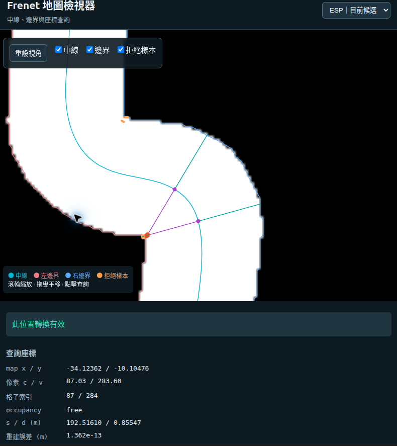
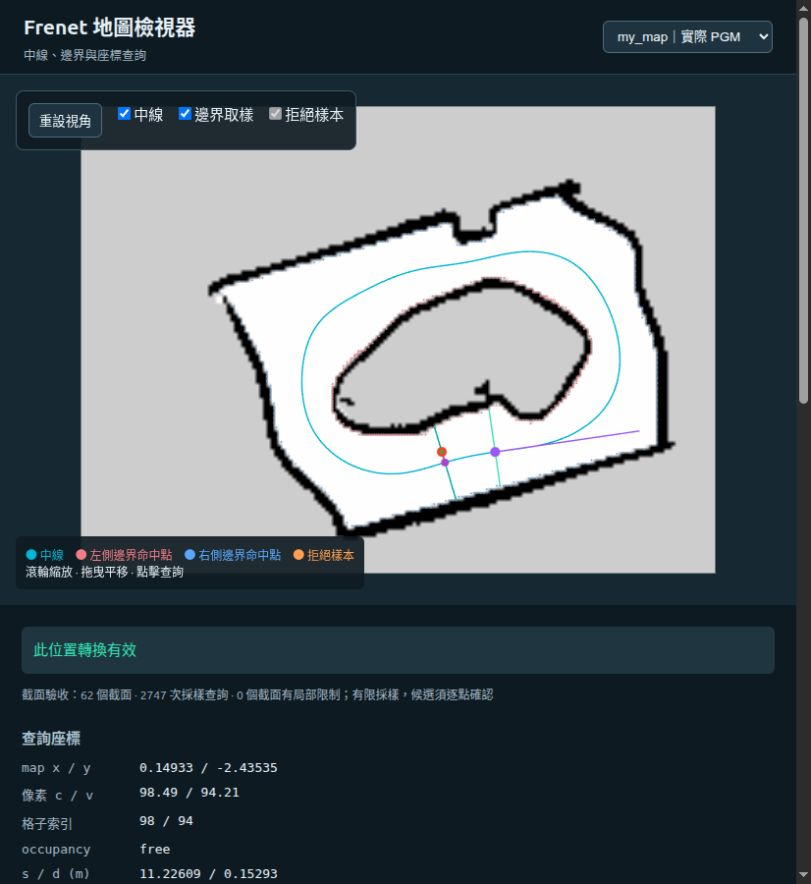

# Frenet 地圖檢視器

本機離線工具可切換 ESP、AUT、GBR、MCO、CornerHall 與實際 PGM `my_map`，檢查中線、邊界與座標轉換。完成狀態及數值證據見[完成總結](status.md)。

## 啟動

在已安裝依賴的環境，從 repository 根目錄執行：

```bash
python -B -m f1tenth_benchmarks.research.core.geometry.viewer \
  --catalog maps/frenet/inspector_catalog.json --port 8765
```

再開啟 [http://127.0.0.1:8765](http://127.0.0.1:8765)。Ctrl+C 停止服務。

Linux 既有 Docker 映像可使用：

```bash
docker run --rm --name f1tenth-frenet-inspector \
  --user "$(id -u):$(id -g)" --network host \
  -v "$PWD:/workspace:ro" -w /workspace \
  f1tenth-sim:full \
  python -B -m f1tenth_benchmarks.research.core.geometry.viewer \
  --catalog maps/frenet/inspector_catalog.json --port 8765
```

從 repository 根目錄執行才能正確掛載。服務只綁定 127.0.0.1。若 8765 已由這個檢視器使用，直接在瀏覽器開啟上述網址，不要再次啟動；程式不會自動沿用既有服務，同一埠被占用時重新啟動會失敗。

需要重新啟動時，先用 Ctrl+C 停止原服務；上述 Docker 服務可用 `docker stop f1tenth-frenet-inspector` 停止。也可以將啟動指令改為 `--port 8766`，並開啟 `http://127.0.0.1:8766`。若要並行啟動第二個 Docker 容器，還需使用不同的 `--name`。

## 操作

- 滾輪縮放、拖曳平移、點擊查詢像素／map x/y／s/d／occupancy／重建誤差。
- 右上選單切換地圖；切換後清除舊查詢。
- 切換中線、邊界與拒絕樣本圖層。
- 輸入 s/d 作反向轉換，確認原來源截面的有效性。
- 輸入 s 並按「查詢截面」，查看道路 d 範圍、採樣 Frenet 區間、原因與驗證程度。
- 有問題資料時，可依分類選截面／區段並查詢來源樣本。未附歷史診斷的版本不顯示其密集 D 區段。

正式 catalog 讀取 [maps/frenet](../../maps/frenet/README.md) 的 geometry 與 ranges，不需要本機歷史報告。新增版本或歷史診斷的載入方式見[操作指南](usage.md#frenet-地圖檢視器)。

## 結果如何解讀

白色道路影像是原 occupancy；白線是指定 s 的實際法線射線範圍，綠線是接受的採樣區間。邊界紅／藍點是各截面法線首次命中牆面的取樣點，急彎處可能跳換牆面，因此不直接連成物理邊界。

`valid=true` 代表這次精確局部查詢通過。`planning_allowed=false`、`domain_verified=false` 與 `continuous_verified=false` 仍表示未取得全域／規劃批准。選到採樣區間中的 d，仍須查詢該點；後續路線還需在 x/y 檢查車身與動態。

| 原因 | 意義 |
|---|---|
| outside_map | 位於地圖外 |
| occupied／unknown | 位於牆或未知區域 |
| outside_track | 不在選定走廊 |
| singular_frenet | J=1−kappa*d 低於 0.2 工程門檻 |
| ambiguous_projection | 競爭投影，或反向查詢未回到原來源 s/d |
| outside_reference | 開放曲線的 s 超出 [0,L] |

「投影歧義／來源不一致」可能代表兩種不同情況：單點無法唯一選最近投影，或指定 s/d 轉到 x/y 後回到另一組 s/d。後者的 x/y 單點查詢可能有效，仍不能當作原來源通過。兩個候選本身不會觸發拒絕；詳細條件見[轉換規則](interfaces.md#點選位置如何轉成-frenet)。

## 急彎的兩個候選投影



紅點是查詢位置；兩個紫點是同一條青色中線上的投影候選。紫線連接候選與查詢點，青綠線是候選截面的法線。

此案例 map x/y≈(−34.12362,−10.10476)，接受的 s/d≈(192.51610,0.85547) m，重建誤差約 1.362e−13 m。另一候選作診斷顯示，圖片未列其完整距離與 J，不能由圖片認定它也有效。

ESP 另一候選距離差≤0.025 m、且沿中線相隔>1 m 時，單點查詢會拒絕；最近候選 J<0.2 也拒絕，不改選較遠候選。

## CornerHall 開放走廊

方向從下端向上再向左，s 範圍約 [0,21.734160] m。s=0 約為 (5.220297,−16.724879)，終點約為 (−0.061429,−0.114949)。終點不連回起點，超界不外插；端點之外的小端帽區與其他支線不由這條參考線表達。

## my_map 實際 PGM



選擇「my_map｜實際 PGM」。s=0 約為 (0.880876,−2.437139)，正向逆時針；灰色是 unknown，黑色 occupied，白色 free。所保存的範圍樣本沒有拒絕點，因此問題選單為空是預期結果。

點選案例 x/y≈(0.14933,−2.43535) → s/d≈(11.22609,0.15293)，J≈1.01968，重建誤差約 1.043e−15 m。原 YAML、工作門檻與來源保存在 maps/my_map.import.json 及其引用檔案。

工具供檢視與診斷，尚未提供路線規劃或實車控制。查詢結果不推定車身可通行，也不取代後續閉迴路驗收。
