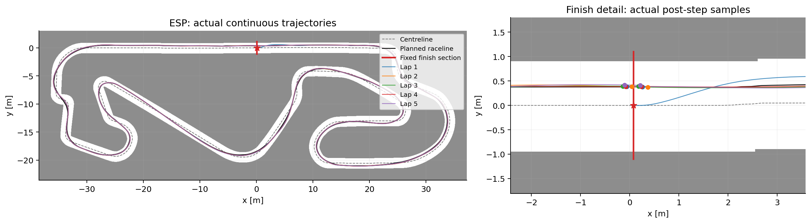
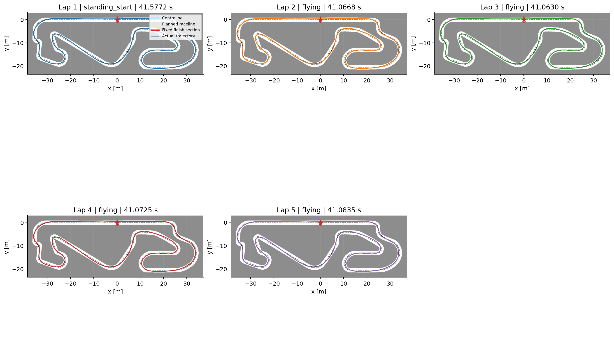
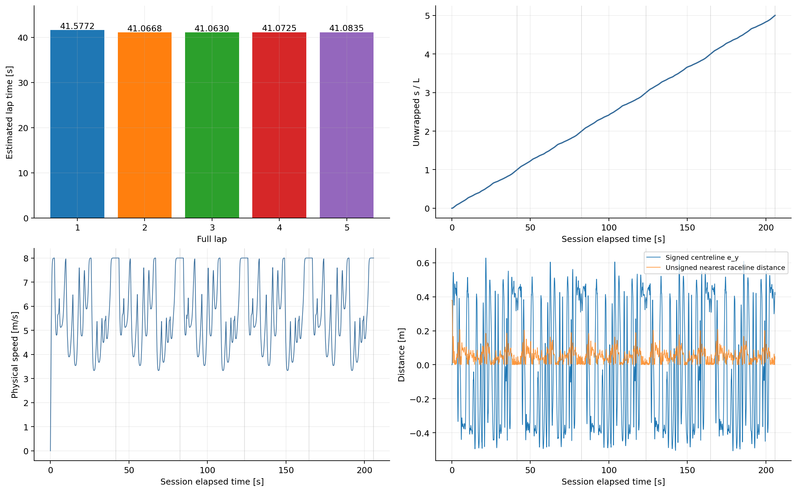

# manual_run_001：連續圈路線圖與結果分析

分析日期：2026-10-01；來源：`Data/research/continuous_laps/stage5/manual_run_001`。

本次完成 **5 個完整圈**，終止原因 `requested_laps_reached`。只 reset 1 次，partial=0，collision=False，projection rejections=0。

## 路線圖

以 ESP 地圖影像、resolution 與 origin 對齊世界座標（m）。灰色虛線為固定中心線，黑線為 mu60_closed raceline；彩色線為各圈實際 post-step XY。紅星及紅線表示固定起終點與法向截面。



總圖中各圈高度重疊，因此另外提供逐圈圖。跨線前後圓點均為實際樣本，沒有產生／假造精確 crossing state；每圈切片保留邊界前後樣本。



## 圈時間與穩定性

| 完整圈 | 類型 | 圈時間估計（s） |
|---|---|---:|
| 1 | standing_start | 41.577166 |
| 2 | flying | 41.066844 |
| 3 | flying | 41.063010 |
| 4 | flying | 41.072549 |
| 5 | flying | 41.083535 |

Flying laps 平均 **41.071484 s**，母體標準差 0.007741 s，最快與最慢差 0.020525 s（平均的 0.0500%）。
起步圈與 flying laps 分開比較；本次結果可重現，不代表其他配置或長期運行的普遍穩定性。

## 進度、速度與路線偏移



- 樣本數：5148；control steps：5147；預設 outer tick：0.04 s。
- 暖機後 session 時間：205.880000 s；物理 simulation time：205.920000 s；暖機時間：0.04 s。
- 速度範圍：0.0000–8.0000 m/s；unwrapped s 負增量數：0。
- 中心線最大 |e_y|：0.627869 m。
- 閉合 raceline 最近線段的無號幾何距離：平均 0.053763 m，P95 0.122642 m，最大 0.379201 m。

中心線偏移不等於 raceline 追蹤誤差：中心線用於 Frenet 進度，raceline 用於規劃。此處新增的 raceline 距離是全域最近線段的 Euclidean 幾何距離，沒有沿程匹配，不能當作控制器穩定性保證或碰撞餘裕。

## 與閉合速度規劃時間比較

原報告未列此表；此次核對 Stage 1 comparison.json 後補上。mu60_closed 的完整 raceline 預估圈時間包含 closure，只計一次。

| 項目 | 時間（s） | 相對規劃增加（s） | 相對規劃增加（%） |
|---|---:|---:|---:|
| mu60_closed 規劃預估 | 40.098769 | — | — |
| Standing-start 第 1 圈 | 41.577166 | 1.478397 | 3.6869% |
| Flying 第 2–5 圈平均 | 41.071484 | 0.972715 | 2.4258% |

- 這是「最小曲率幾何＋閉合速度規劃」的預估，不是已證明的全域最短圈時間。closed profile 沒有從 0 加速的 standing-start 條件，因此 flying 平均更適合作為主要對照。
- 計畫以 raceline 幾何與離散速度計算時間；實測包含七維 dynamics、PID、steering delay、實際偏離 raceline 與 GlobalPurePursuit 的轉向相關 speed cap。planner 的 mu60 規劃模型與 simulator 的 mu=1.0489 不同，不能解讀成完全同模型下的 solver 誤差。
- 差異可能來自上述控制／模型因素，目前沒有逐段歸因。後續可做沿 raceline 匹配的 planned／commanded／physical speed 比較，定位額外時間在哪些路段累積。不要以 simulation time 必須等於 planned time 作通過條件。

## 已執行的驗證與限制

- verify_session 通過：完整圈數、partial 數、一次 reset、post-step NPY、事件插值與前後樣本時間、N 圈 crossing 當步終止。
- 原 DynamicsSimulator 獨立重播每個樣本（state atol=1e-12），確認七維 state 與 steering buffer 持續延續，crossing 沒有 reset；scan 形狀及有限值檢查通過。
- 原受保護檔案目前 hashes 未變；中心線與 raceline hashes 和該 session metadata 一致。
- 最終 physical sample 晚於 crossing estimate 約 16.896 ms，保留实际樣本，不 rewind dynamics。
- 圈時間為沿程線性插值估計，並非精確 crossing 時刻；只驗收本 ESP/config。原 sampled 四角碰撞模型與 Stage 2 取樣／投影限制仍適用。

## 產物與重現方式

- [原圈結果 CSV](../../Data/research/continuous_laps/stage5/manual_run_001/lap_results.csv)
- [原 session metadata](../../Data/research/continuous_laps/stage5/manual_run_001/session.json)
- [本次分析數值與輸入 hashes](figures/manual_run_001/analysis.json)

所有圖皆另存 PNG（閱讀）與 SVG（向量匯出）。本次只讀取已保存 simulation，不重新賽車、不修改原始結果。產生器拒絕覆寫已有 report／figures 目錄。

在已開啟的 Docker 容器 `/workspace` 執行；若重新產生，請換全新 report／figures 名稱：

```bash
python -B -m f1tenth_benchmarks.research.plot_continuous_report \
  --session-dir Data/research/continuous_laps/stage5/manual_run_001 \
  --report docs/research/manual_run_001_report.md \
  --figures-dir docs/research/figures/manual_run_001
```
